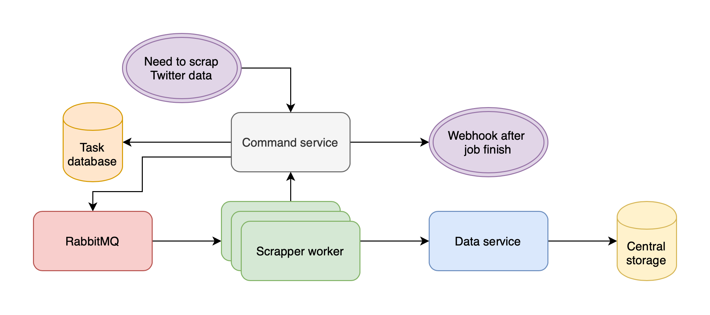

# Twitter-Distributed [IN PROGRESS]
Sometimes there is a need to scrap many enormous tweet data in short time.
This project help to do this task. Solution is based on Twint -- popular tool
to scrap twitter data. 

## Main concepts
 - Prepare architecture of microservices, which is scalable and can be 
 distributed for many machines 
 - Divide single scrap tasks for small task
 - Support that wne worker have error and the elementary task can be repeated 
 on other instance
 - Workaround twitter limit, which disallow to download many data from one ip address
 